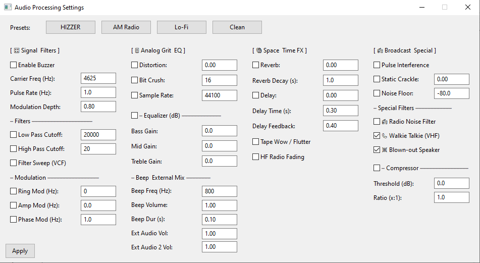
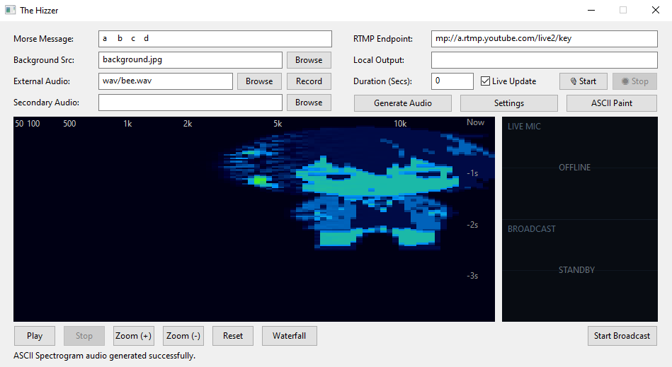
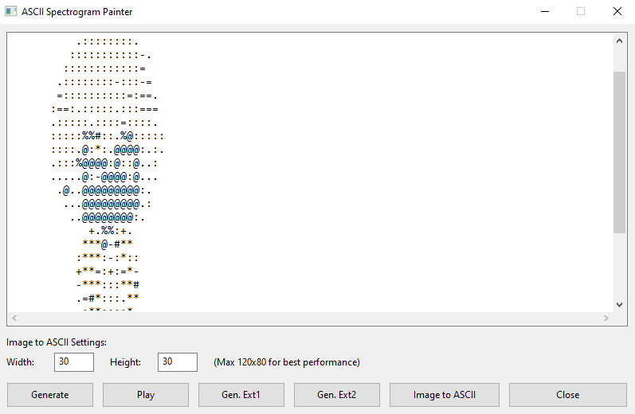

# The Hizzer - Audio Processing & Streaming Suite

A fun experimental tool for real-time audio processing with Morse code synthesis, broadcast-style effects, live microphone mixing, ASCII art audio synthesis, and streaming capabilities. Replicates the classic "buzzer" sound found in shortwave radio transmissions.

## Features

### Audio Processing Chain
- **Filters** - Low-pass, high-pass, band-pass, resonant filter sweep
- **Distortion & Lo-Fi** - Adjustable distortion, bit crushing, sample rate reduction
- **Modulation** - Ring modulation, amplitude modulation, phase modulation
- **Time-based Effects** - Reverb with adjustable decay, delay with feedback
- **EQ & Dynamics** - 3-band EQ (bass/mid/treble), dynamic range compressor
- **Noise Generation** - Noise floor, pulse interference, static crackle simulation

### Special Broadcast Effects
- **HIZZER Carrier** - Configurable carrier frequency (4625 Hz typical), pulse rate, and modulation depth
- **Radio Noise** - Simulates atmospheric noise, power line hum, and RF heterodyne whistles
- **Walkie-Talkie** - Simulates VHF radio with steep band-pass and carbon mic saturation
- **Blown-out Speaker** - Hard clipping and wavefolding distortion
- **Tape Wow/Flutter** - Classic analog tape pitch instability
- **Radio Fading** - HF multi-path propagation fading simulation

### Real-time Visualizers
- **Waveform** - Zoom and pan with mouse drag
- **Spectrum Analyzer** - Peak hold and dB grid overlay
- **Waterfall Spectrogram** - Color-coded frequency vs time display

### Morse Code Synthesis
- Convert text to Morse with configurable tone frequency and timing
- Adjustable dot/dash duration and beep volume

### External Audio Mixing
- Layer up to 2 external WAV files (supports resampling to 44.1 kHz)

### Live Microphone Capture
- Real-time microphone input via DirectShow
- Live waveform monitoring (split-screen display)
- Record microphone to WAV file for later use

### ASCII Art Audio Synthesis
- Convert ASCII art or images to frequency-domain audio
- Real-time spectrogram generation from text/art
- ASCII art painter with image-to-ASCII conversion

### Broadcast Monitor
- Split-screen live visualization showing:
  - **Top**: Live microphone input waveform
  - **Bottom**: Broadcast audio stream waveform

### Streaming & Recording
- **RTMP Streaming** - Live streaming via FFmpeg
- **Local Recording** - Output to file (supports MP4 container)
- Automatic reconnection on stream disconnection

## Preview

### Waveform


### Spectrum Analyzer


### Waterfall


### Audio Processing


### ASCII Spectrogram


### ASCII Generator


## System Requirements

- Windows OS (DirectShow audio capture)
- FFmpeg in PATH
- Go 1.21+ (for building)

## Quick Start

1. Install FFmpeg and ensure it's in your PATH
2. Run `hizzer.exe`
3. Enter Morse message and RTMP URL (optional)
4. Click **Audio Settings** to configure effects
5. Click **Generate with Effects** to create the audio
6. Preview with Play/Pause/Stop buttons
7. Click **Start Broadcast** to begin streaming

## Controls & Interface

### Main Window
| Control | Function |
|---------|----------|
| Morse Message | Text to convert to Morse code |
| Background Src | Image or video file for stream background |
| RTMP Endpoint | Streaming server URL |
| Local Output | File path for local recording |
| External Audio 1 & 2 | WAV files to mix with Morse |
| Duration | Stream duration limit (0 = unlimited) |
| Live Update | Auto-refresh visualizers on audio generation |
| Start/Stop | Live microphone capture |

### Audio Settings Panel

#### Signal & Filters
- Buzzer Carrier (frequency, pulse rate, modulation depth)
- Low-pass / High-pass filters
- Filter Sweep (VCF)

#### Analog Grit & EQ
- Distortion amount
- Bit crushing depth
- Sample rate reduction
- 3-band Equalizer (-12 to +12 dB)

#### Space & Time FX
- Reverb (amount, decay time)
- Delay (amount, time, feedback)
- Tape Wow/Flutter

#### Broadcast & Special
- Pulse interference
- Static crackle
- Noise floor (dB)
- Radio Noise Filter
- Walkie-Talkie (VHF) Filter
- Blown-out Speaker Filter
- Compressor (threshold, ratio)

#### Beep & Mix Settings
- Beep frequency, volume, dot duration
- External audio 1 & 2 volume

### ASCII Art Painter
- Create or edit ASCII art for spectrogram synthesis
- Import images (PNG, JPG) to convert to ASCII
- Generate audio directly or save to external audio slots
- Real-time waterfall visualization of the generated content

### Playback Controls
- **Play/Pause** - Control audio preview
- **Stop** - Stop playback
- **Zoom (+/-)** - Waveform zoom (spectrum not affected)
- **Reset** - Reset waveform zoom
- **Waveform/Spectrum/Waterfall** - Cycle visualizer modes

### Broadcast Controls
- **Start Broadcast** - Begin streaming to RTMP or local file
- Monitor panel shows live mic and broadcast waveforms

## Presets

| Preset | Description |
|--------|-------------|
| **HIZZER** | Full processing chain with buzzer, filters, distortion, delay, reverb, compressor |
| **AM Radio** | Broadcast simulation with radio noise, gentle compression, fading |
| **Lo-Fi** | Bit crushing, sample reduction, tape wow/flutter, heavy compression |
| **Clean** | Minimal processing, no effects, full bandwidth |

## Building

```bash
go build -o hizzer.exe main.go
```

## Dependencies

- [beep](https://github.com/faiface/beep) - Audio playback
- [wui](https://github.com/gonutz/wui) - Windows GUI
- FFmpeg - Streaming pipeline and microphone capture

## Configuration

Settings are automatically saved to `hizzer.config.json` in the same directory as the executable, preserving:
- All audio processor parameters
- Morse message text
- Background source path
- RTMP URL and output file path
- External audio file paths
- Stream duration
- Visualizer mode
- Live mic state

## License

The Hizzer is distributed under the [MIT License](LICENSE).