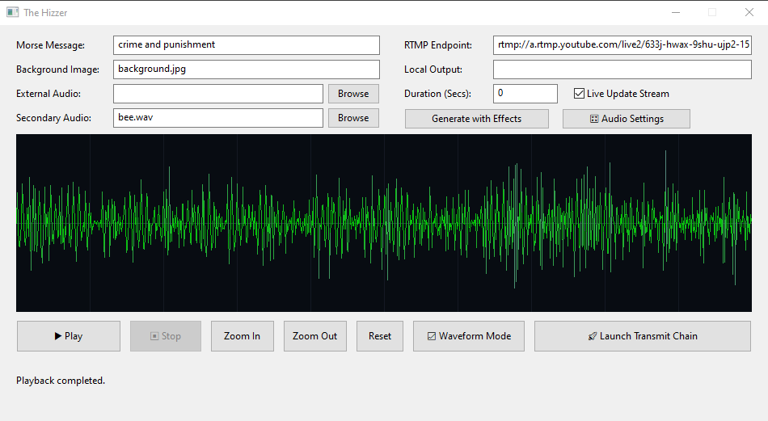
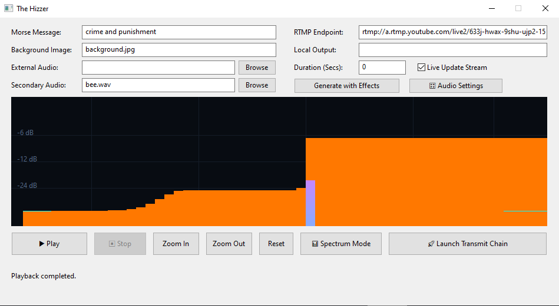
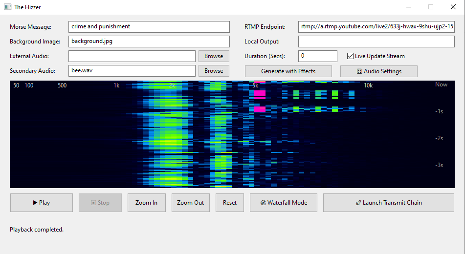

# The Hizzer - Audio Processing & Streaming Suite

A fun experimental tool for real-time audio processing with Morse code synthesis, broadcast-style effects, and streaming capabilities. Replicates the classic "buzzer" sound found in shortwave radio transmissions.

## Features

- **Audio Processing Chain** - Filters, distortion, compression, EQ, reverb, delay, ring/amplitude/phase modulation
- **Special Effects** - HIZZER carrier signal, AM radio, Walkie-Talkie, tape wow/flutter, radio fading, filter sweep
- **Real-time Visualizers** - Waveform, spectrum analyzer, waterfall spectrogram
- **Morse Code Synthesis** - Convert text to Morse with configurable tone and timing
- **External Audio Mixing** - Layer up to 2 external WAV files
- **Live Streaming** - RTMP streaming via FFmpeg
- **Local Recording** - Output to file

## Preview

| Waveform | Spectrum Analyzer | Waterfall |
|----------|------------------|-----------|
|  |  |  |

## System Requirements

- Windows OS
- FFmpeg in PATH
- Go 1.21+ (for building)

## Quick Start

1. Install FFmpeg
2. Run `hizzer.exe`
3. Enter Morse message and RTMP URL (optional)
4. Click **Audio Settings** to configure effects
5. Click **Generate with Effects**
6. Preview with Play button
7. Click **Launch Transmit Chain** to stream

## Presets

- **HIZZER** - Full processing chain
- **AM Radio** - Broadcast simulation
- **Lo-Fi** - Bit crushing & sample rate reduction
- **Clean** - Minimal processing

## Building

```bash
go build -o hizzer.exe main.go
```

## Dependencies

- [beep](https://github.com/faiface/beep) - Audio playback
- [wui](https://github.com/gonutz/wui) - Windows GUI
- FFmpeg - Streaming pipeline

## License

Tender is distributed under the [MIT License](LICENSE).